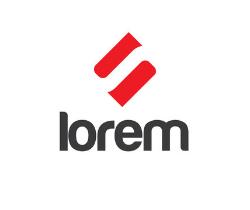

# 🌍 Multi-Language Lorem Ipsum Generator

<div align="center">



### Generate contextual placeholder text in 12 languages with 6 topic-based categories


**The most comprehensive Lorem Ipsum generator for VS Code with support for 12 languages and topic-specific content**

[Features](#-features) • [Installation](#-installation) • [Usage](#-usage) • [Examples](#-examples) • [Contributing](#-contributing)

</div>

---

## 🎯 Why Choose This Extension?

Traditional lorem ipsum generators provide generic Latin text that doesn't reflect real-world content. **Multi-Language Lorem Ipsum** solves this by offering:

- ✨ **12 World Languages** - Generate placeholder text in the language your project actually uses
- 🎨 **Topic-Based Categories** - Get contextually relevant content for different industries
- 🎲 **Multiple Variations** - Each combination includes 3-4 different texts to avoid repetition
- ⚡ **Instant Insert** - Text appears directly at your cursor position
- ⌨️ **Keyboard Shortcuts** - Quick access with customizable hotkeys
- 📦 **216+ Combinations** - 12 languages × 6 categories × 3 lengths = endless possibilities

---

## 🌟 Features

### 🌍 Multi-Language Support

Generate placeholder text in 12 major world languages:

| Language   | Native Name | Script   | Example                            |
| ---------- | ----------- | -------- | ---------------------------------- |
| English    | English     | Latin    | "Innovative software solutions..." |
| Persian    | فارسی       | Persian  | "سفری به یاد ماندنی را با..."      |
| Arabic     | العربية     | Arabic   | "حلول رعاية صحية متقدمة..."        |
| Chinese    | 中文        | Chinese  | "推动企业增长和卓越..."            |
| Japanese   | 日本語      | Japanese | "息をのむような景色を..."          |
| Russian    | Русский     | Cyrillic | "Откройте для себя..."             |
| Spanish    | Español     | Latin    | "Descubre paisajes..."             |
| French     | Français    | Latin    | "Découvrez des paysages..."        |
| German     | Deutsch     | Latin    | "Entdecken Sie atemberaubende..."  |
| Italian    | Italiano    | Latin    | "Scopri paesaggi mozzafiato..."    |
| Portuguese | Português   | Latin    | "Descubra paisagens..."            |
| Korean     | 한국어      | Hangul   | "숨막히는 풍경을 발견하고..."      |

### 📂 Topic-Based Categories

Each language includes professionally written content for 6 categories:

- 🏖️ **Tourism** - Travel, destinations, cultural experiences, tour packages
- ⚕️ **Medical** - Healthcare, treatments, medical services, patient care
- 💻 **Technology** - Software, digital transformation, IT solutions, development
- 💼 **Business** - Consulting, strategy, corporate services, growth
- 📚 **Education** - Learning, academic programs, schools, training
- 🍽️ **Food** - Culinary, restaurants, gastronomy, recipes

### 📏 Three Text Lengths

- **Short** (1 sentence) - Perfect for headings, labels, and buttons
- **Medium** (2-3 sentences) - Ideal for descriptions, previews, and cards
- **Long** (5+ sentences) - Great for paragraphs, articles, and detailed content

### 🎲 Variation System

Unlike traditional generators, each combination includes **3-4 unique variations**. Generate the same category and length multiple times to receive different content - no more repetitive placeholder text!

---

## 📦 Installation

### From VS Code Marketplace

1. Open **VS Code**
2. Go to Extensions (`Ctrl+Shift+X` or `Cmd+Shift+X`)
3. Search for **"Multi-Language Lorem Ipsum"**
4. Click **Install**

### Manual Installation

```bash
# Clone the repository
git clone https://github.com/yourusername/multi-language-lorem.git
cd multi-language-lorem

# Install dependencies
npm install

# Compile
npm run compile

# Press F5 in VS Code to launch Extension Development Host
```

---

## 🚀 Usage

### Quick Start

1. **Place your cursor** where you want the text
2. Press `Ctrl+Shift+P` (Windows/Linux) or `Cmd+Shift+P` (Mac)
3. Type `Lorem` and select a command
4. Choose **category** and **length**
5. Text is inserted instantly! ✨

### Available Commands

- `Lorem: Generate English Text`
- `Lorem: Generate Persian Text (فارسی)`
- `Lorem: Generate Arabic Text (العربية)`
- `Lorem: Generate Chinese Text (中文)`
- `Lorem: Generate Japanese Text (日本語)`
- `Lorem: Generate Russian Text (Русский)`
- `Lorem: Generate Spanish Text (Español)`
- `Lorem: Generate French Text (Français)`
- `Lorem: Generate German Text (Deutsch)`
- `Lorem: Generate Italian Text (Italiano)` ⭐ NEW
- `Lorem: Generate Portuguese Text (Português)` ⭐ NEW
- `Lorem: Generate Korean Text (한국어)` ⭐ NEW
- `Lorem: Generate Custom Text` - Full control over language, category, and length

### ⌨️ Keyboard Shortcuts

Boost your productivity with these default shortcuts:

- **`Ctrl+Alt+L`** (Mac: `Cmd+Alt+L`) - Open Custom Generator (choose language, category, length)
- **`Ctrl+Alt+Shift+E`** (Mac: `Cmd+Alt+Shift+E`) - Quick English Text

> 💡 **Tip:** You can customize these shortcuts in VS Code's Keyboard Shortcuts settings (`Ctrl+K Ctrl+S`)

### 💡 Pro Tips

- **Use keyboard shortcuts** for instant access to lorem generation
- **Generate multiple times** to get different variations
- **Mix languages** in multilingual projects
- **Use topic-specific content** for more realistic mockups
- **Try different categories** to match your project context
- **Customize shortcuts** to match your workflow

---

## 📖 Examples

### English - Technology (Short)

```
Innovative software solutions powering digital transformation across industries.
```

### Persian - Tourism (Medium)

```
سفری به یاد ماندنی را با بازدید از جاذبه‌های گردشگری بی‌نظیر تجربه کنید. از کوهستان‌های مرتفع تا سواحل زیبا، هر مقصد داستانی دارد. تورهای گردشگری ما با راهنمایان حرفه‌ای و برنامه‌ریزی دقیق، لحظات فراموش‌نشدنی را برای شما رقم می‌زنند.
```

### Arabic - Medical (Short)

```
حلول رعاية صحية متقدمة مع تكنولوجيا طبية حديثة وأطباء خبراء.
```

### Chinese - Business (Medium)

```
推动企业增长和卓越运营的战略咨询服务。我们经验丰富的顾问提供可行的见解、市场分析和转型路线图。我们与组织合作，释放价值并实现可持续的竞争优势。
```

### Spanish - Food (Long)

```
Creaciones culinarias exquisitas utilizando ingredientes frescos de origen local y recetas auténticas. Nuestros talentosos chefs elaboran platos excepcionales que celebran sabores diversos y tradiciones culinarias. Cada comida es un viaje a través del sabor, la textura y la excelencia en la presentación. Desde la frescura de la granja a la mesa hasta la cocina de fusión innovadora, deleitamos paladares exigentes con menús de temporada.
```

---

## 🏗️ Project Structure

```
multi-language-lorem/
├── src/
│   ├── extension.ts              # Main extension logic
│   ├── logo.png                  # Extension logo
│   └── lorem-data/               # Language data modules
│       ├── english.ts            # 🇬🇧 English lorem texts
│       ├── persian.ts            # 🇮🇷 Persian lorem texts
│       ├── arabic.ts             # 🇸🇦 Arabic lorem texts
│       ├── chinese.ts            # 🇨🇳 Chinese lorem texts
│       ├── japanese.ts           # 🇯🇵 Japanese lorem texts
│       ├── russian.ts            # 🇷🇺 Russian lorem texts
│       ├── spanish.ts            # 🇪🇸 Spanish lorem texts
│       ├── french.ts             # 🇫🇷 French lorem texts
│       └── german.ts             # 🇩🇪 German lorem texts
├── out/                          # Compiled JavaScript files
├── .vscode/
│   ├── launch.json               # Debug configuration
│   └── tasks.json                # Build tasks configuration
├── package.json                  # Extension manifest
├── tsconfig.json                 # TypeScript configuration
├── README.md                     # This file
├── CHANGELOG.md                  # Version history
└── ARRAY_STRUCTURE_GUIDE.md      # Development guide
```

---

## 🛠️ Development

### Prerequisites

- **Node.js** 18.x or higher
- **VS Code** 1.85.0 or higher
- **TypeScript** 5.3 or higher

### Setup for Development

```bash
# Install dependencies
npm install

# Compile TypeScript
npm run compile

# Run in watch mode (auto-compile on changes)
npm run watch

# Run linter
npm run lint
```

### Testing

1. Open the project in VS Code
2. Press `F5` to launch Extension Development Host
3. Test commands in the new VS Code window
4. Check Debug Console for logs

### Adding New Languages

See `ARRAY_STRUCTURE_GUIDE.md` for detailed instructions on adding new languages.

Quick steps:

1. Create new file in `src/lorem-data/`
2. Export object with 6 categories
3. Each category has 3 arrays (short, medium, long)
4. Each array contains 3-4 text variations
5. Import and register in `extension.ts`

---

## 📊 Statistics

| Metric                        | Value |
| ----------------------------- | ----- |
| **Languages**                 | 9     |
| **Categories per Language**   | 6     |
| **Text Lengths**              | 3     |
| **Variations per Length**     | 3-4   |
| **Total Unique Combinations** | 162+  |
| **Total Different Texts**     | 450+  |

---

## 🤝 Contributing

We welcome contributions! Here's how you can help:

### 🌐 Adding More Languages

- Korean, Italian, Portuguese, Turkish, Hindi, etc.
- Follow existing structure in `src/lorem-data/`
- Provide professional, contextually accurate texts

### 📂 Adding More Categories

- Sports, Science, Art, Entertainment, Real Estate, etc.
- Maintain consistency across all languages

### 🐛 Reporting Issues

- Use [GitHub Issues](https://github.com/yourusername/multi-language-lorem/issues)
- Provide clear description and steps to reproduce

### 💡 Feature Requests

- Open a [Discussion](https://github.com/yourusername/multi-language-lorem/discussions)
- Explain the use case and benefits

---

## 📝 License

This project is licensed under the **MIT License** - see the [LICENSE](LICENSE) file for details.

---

## 🙏 Acknowledgments

- Inspired by the need for realistic, multi-language placeholder text
- Built with ❤️ for the VS Code community
- Thanks to all contributors and users who help improve this extension

---

## 📧 Support & Contact

- **Issues**: [GitHub Issues](https://github.com/yourusername/multi-language-lorem/issues)
- **Discussions**: [GitHub Discussions](https://github.com/yourusername/multi-language-lorem/discussions)
- **Email**: your.email@example.com

---

## 🔮 Roadmap

### v0.1.0 (Coming Soon)

- [ ] Marketplace publication
- [ ] Add Italian, Portuguese, Korean languages
- [ ] Custom keyboard shortcuts

### v0.2.0

- [ ] AI-powered dynamic text generation
- [ ] Custom text length (exact word/character count)
- [ ] Save favorite combinations

### v0.3.0

- [ ] Export/import custom templates
- [ ] Integration with popular frameworks
- [ ] VS Code snippets support

### Future

- [ ] More languages (20+ total)
- [ ] More categories (12+ total)
- [ ] API for external usage
- [ ] Community-contributed templates

---

## 📈 Changelog

### [0.0.1] - 2025-10-13

#### Added

- Initial release
- Support for 9 languages
- 6 topic-based categories
- 3 text length options
- Multiple variations per combination
- Modular architecture
- Random text selection
- Direct cursor insertion

---

<div align="center">

### ⭐ If you find this extension useful, please star the repository!

**Made with 💙 by developers, for developers**

[Report Bug](https://github.com/yourusername/multi-language-lorem/issues) • [Request Feature](https://github.com/yourusername/multi-language-lorem/issues) • [Give Feedback](https://github.com/yourusername/multi-language-lorem/discussions)

---

**Happy Coding! 🚀**

</div>
